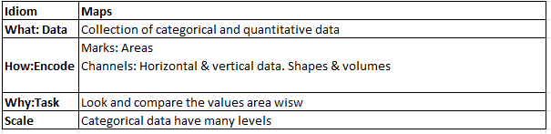

```{r setup, include=FALSE}
knitr::opts_chunk$set(echo = TRUE)
knitr::opts_chunk$set(echo=TRUE,warning=FALSE,message=FALSE,highlight = TRUE,prompt =TRUE,tidy=TRUE)
options(width=120)
```
```{r echo=FALSE}

library(dplyr)
library(tidyr)
library(magrittr)
library(knitr)
library(ggplot2)
library(stats)
library(vcd)
library(vcdExtra)
library(ggpubr)
library(RColorBrewer)
library(broom)
library(viridis)
library(plotly)
library(ggpubr)
library(caTools)
library(caret)
library(class)
library(corrplot)
library(mapdata)
library(maps)
library(mapproj)
```

## Important

**Due Date:**  Noon on Thursday 12th of December

**Submission:**  Compile your answers in this RMarkdown file.  Upload it, and supporting files, and a pdf rendering into the appropriate spot in Canvas.

**Rules:** As this is a take home test, there can't be any restrictions I can enfornce. I do ask that you do your own work. DO NOT give your R to another by email, usb drive, or the like.  Do not let people take pictures of your R code. 

**Time of Last Revision:**  8:00 am 4 December, 2019

## Example - Bar Chart

I want to begin the final with an example for you.  This example will demonstrate several nice features available to us in the {ggpubr} package.

The format of these visualization exercises may include the following:

1. A data file or (R dataset)
2. A professional quality visualization addressing the task including a text caption offering some explanation or observation
3. An explanation of the idiom in the form of "What? Why? How?" table. (see box to follow)


We will call these "What-Why-Hows"

Note: I believe that a good test should teach you new things and not just stress your internal organs into rupture.  Hence, I will often tell you to look up and use particular commands from various packages.

```{r }

theme_set(theme_pubr() + theme(legend.position = "right"))

diam_df<- diamonds %>% group_by(cut) %>% dplyr::summarise(counts=n())

diam_df

diam.bar.p<-ggplot(diam_df, aes(x=cut,y=counts)) + 
  geom_bar(fill= "blue",stat="identity") +
  geom_text(aes(label=counts),vjust=-0.3)

diam.bar.p <- diam.bar.p + labs(title="Distribution of Diamond Inventory",
                                subtitle="Plot of the number of diaonds in each cut group",
                                caption="Data Source: diamonds dataset",
                                x= "Classifcation by Type of Cut",
                                y= "Total Amount in Inventory")+ 
                            scale_fill_brewer(palette="Dark2") 


  
text.bar<-paste("This chart shows stock increases dramatically for the higher quality cuts.  This is fortunate as we can expect a higher profit margin for the Premium and Ideal cuts.")

text.bar.p<-ggparagraph(text=text.bar,face="italic",size=11,color="black")

ggarrange(diam.bar.p,text.bar.p,ncol=1,nrow=2,heights=c(3.5,0.5))+
  theme_pubclean()

```

##  Texas Housing
Explore the dataset "txhousing" in {ggplot2}. 

"Information about the housing market in Texas provided by the TAMU real estate center, http://recenter.tamu.edu/."

#### What-Why-How 1: Histogram
Include a What-Why-How for the histogram idiom. 

#### Plot 1: Histogram 
  Create a quality histogram of the median price of the houses being sold.  Make the x-axis show currency and not in scientific notation.  Give it a reasonable title.  
  
#### Plot 2: Density
Building upon the previous chart, overlay an opaque density on the histogram.

#### Graduate Students Only Plot 1: Visual investigation of inventory problem
Create to subgroups.  The A subgroup will be the subset of housing residing in cities beginning with the letter "A".  Create an "S" subgroup as well.  On the same plot, over the the densities.  In a text paragraph beneath the histograms, discuss if there seems to be any real difference in the probabilities of selling homes in those cities.

#### Answer:
### What-Why-How 1: Histogram ###

```{r }
#### Plot 1: Histogram ####
txhousing_print<- print(txhousing)
txhousing_summary<- summary(txhousing)
txhousing_df<-txhousing %>% 
  group_by(median) %>%
  group_by(month) %>%
  dplyr::summarise(counts=n())
txhousing_df

txhousing.hist<-ggplot(txhousing, aes(x = median)) +
  geom_histogram(fill= "blue")

txhousing.hist <- txhousing.hist + labs(title="Median price of the houses being sold",
                                subtitle="Plot of the number of houses sold and price",
                                caption="Data Source: Texas Housing",
                                x= "Median",
                                y= "Count")+ 
                            scale_fill_brewer(palette="Dark2")

txhousing.hist
#### Plot 2: Density ####
txhousing.density<-ggplot(data = txhousing, aes(x = median)) +
  geom_density()
txhousing.density

####Graduate Students Only Plot 1: Visual investigation of inventory problem ####
p <- ggplot(txhousing, aes(date, median)) +
  geom_line(aes(group = city), alpha = 0.2)
p
models <- txhousing %>% 
  group_by(city) %>%
  do(mod = lm(
    log2(sales) ~ factor(month), 
    data = ., 
    na.action = na.exclude
  ))
models
model_sum <- models %>% glance(mod)
model_sum

```


## Colorblind Flowers?
In this problem set, you will create scatterplots without and with grouping, and finally with regression analysis.  We will use the ever popular iris dataset.  We place the restriction on the problem that the visualizations should be colorblindness friendly.

For your colors, you are to use the {viridis} R package.  It uses beautiful colors that are printer-friendly and uniform, and easy to use.

Use the minimal theme from {ggpubr}


#### What-Why-How 2: 2-d scatterplot
Insert the visual idiom description for a 2-d scatterplot.

#### Plot 3: Scatterplot
Using a minimal theme, create a scatterplot of Sepal.Length against Sepal.Width. Create visual grouping of the species suitable for colorblind people.  Overlay a regression line with standard error bands.  Make sure the axises have physical units listed. 

#### Plot 4:  Type of Dot Plot
It would seem to me another approach to aiding those whose are colorblind is to use changes in size of the dots.  So for this plot, retain the coloration from the viridis palette, but also change the size of the circle for each species.  That is there will be three size circles, each of a constant colorblind-friendly color.  Make sure the legend makes clear the two-fold way of visualizing the grouping.  A text sentence might be helpful. 

#### Plot 5: Facetting
Yet another way to help is to seperate the scatterplots.  For this plot, facet three scatterplots in a row. One scatterplot per species.  For this one, include the regression line and error bands around each subplot. 

#### Plot 6:  Grouping
We could also highlight the groups for the colorblind (or really any) viewer by putting an enclosing figure about clusters of points, such as an ellipse, around clusters of points.  There are many ways and means of doing this, but try the stat_ellipse() function.

#### Graduate Students Only Plot 2:  Edge Densities
Explore the ggscatterhist() plot in {ggpubr}. Create a scatterplot as above without the regression line and error bands. Colorize the groups by species using colorblind safe colors.  Finally have the upper edge and right edge present density histrographs to reflect the marginal distributions. 

#### Answer:

### What-Why-How 2: 2-d scatterplot####

```{r}

library(ggplot2)
#### Plot 3: Scatterplot ####
head(iris)
ggplot(iris, aes(x=Sepal.Length, y=Petal.Length, color=Species)) + geom_point()

pl <- iris$Petal.Length
sl <- iris$Sepal.Length
model <- lm(pl ~ sl)
model
pred <- predict(model, data.frame(sl = sort(sl)), level = 0.95, interval = "confidence")
head(pred)
lower <- pred[,2]
upper <- pred[,3]

# make plot 
plot(sl, pl, pch=19, type="n")
grid()
polygon(c(sort(sl), rev(sort(sl))), c(upper, rev(lower)), col = "gray", border = "gray")
points(sl, pl, pch=19, cex=0.6)
abline(model, col="red", lwd=2)

#### Plot 4: Type of Dot Plot ####
pal <- c("red", "blue", "green")
pal <- setNames(pal, c("virginica", "setosa", "versicolor"))

p <- plot_ly(data = iris, x = ~Sepal.Length, y = ~Petal.Length, color = ~Species, colors = pal,size=30)
p
```


```{r}
#### Plot 5: Facetting ####
ggplot(iris, aes(x=Sepal.Length, y=Petal.Length)) + geom_point() + facet_wrap(~Species)

facet <- ggplot(data=iris, aes(Sepal.Length, y=Sepal.Width, color=Species)) + 
  geom_point(aes(shape=Species), size=1.5) + geom_smooth(method="lm") +
  xlab("Sepal Length") + ylab("Sepal Width") + ggtitle("Faceting")

# Along rows
facet + facet_grid(. ~ Species)
# Along columns
facet + facet_grid(Species ~ .)
#### Plot 6: Grouping ####
ggplot(iris, aes(x=Petal.Length, y=Petal.Width, colour=Species)) +
   geom_point() +
   stat_ellipse()
#### Graduate Students Only Plot 2: Edge Densities ####
# Basic scatter plot with marginal density plot
ggscatterhist(iris, x = "Sepal.Length", y = "Sepal.Width",
              color = "#00AFBB",
              margin.params = list(fill = "lightgray"))


# Grouped data
ggscatterhist(
 iris, x = "Sepal.Length", y = "Sepal.Width",
 color = "Species", size = 3, alpha = 0.6,
 palette = c("#00AFBB", "#E7B800", "#FC4E07"),
 margin.params = list(fill = "Species", color = "black", size = 0.2)
)

# Use boxplot as marginal
ggscatterhist(
 iris, x = "Sepal.Length", y = "Sepal.Width",
 color = "Species", size = 3, alpha = 0.6,
 palette = c("#00AFBB", "#E7B800", "#FC4E07"),
 margin.plot = "boxplot",
 ggtheme = theme_bw()
)
```


## A data item of Many Hats

A data item consisting of a quantitative value such as a count and two categorical attributes is simple enough to wear at least a dozen different visual idioms.

#### Plot 7: Mystery Idiom

In the R package {vcdExtra} there is a dataset called GSS. 

>General Social Survey– Sex and Party affiliation
Description
Data from the General Social Survey, 1991, on the relation between sex and party affiliation.

To prepare us in reading the visualization, present the head and structure of the file. Once you have identified this visual idiom give a quality visualizations with title, and descriptive axes.  Use colors from the correct type of Brewer color palette. Report the totals in the vis gylph. [Hint: {ggpubr} has a nice wrapper. ]


#### Plot 8 - Playing Dodge ball
Repeat the above but dodge the bars rather than stack them. 

#### Answer:
```{r}
#### A data item of Many Hats//Plot 7: Mystery Idiom//Plot 8 - Playing Dodge ball ####
library(vcdExtra)
library(ggplot2)
head(GSS)
structure(GSS)
data(GSS)
plot(GSS)
(GSStab <- xtabs(count ~ sex + party, data=GSS))
GSStab
mod.glm <- glm(count ~ sex + party, family = poisson, data = GSS)
mod.glm
GSS <- data.frame(
  expand.grid(sex=c("female", "male"), 
              party=c("dem", "indep", "rep")),
  count=c(279,165,73,47,225,191))
GSS
names(GSS)
str(GSS)
sum(GSS$count)
ggplot(GSS, aes(x=sex, y=count)) + geom_point()
```
#### Plot 9  geom_count
{ggplot2} has introduced a new geom called "geom_count".  It is a mixture of dot plot and tile plot.  See the examples in <https://ggplot2.tidyverse.org/reference/geom_count.html>.

Use the diamond data set to create a visualization where there is a disk present for each combination of "color" (color as in the property of the gem), and "clarity".  The size of the disk reflects the total proportion of the diamonds in this joint-category scaled by the number of diamonds in the entire set.

Visualize the data items described above.  Intoduce a title and subtitle.  Improve the x and y axis and see what you can do to the legend.  Include a caption.  Finally add a small paragraph of text explaining to the owners what patterns are seen to exist in their inventory visualization.

Pick an appropriate publication theme.


#### What-Why-How 3:  geom_count
Insert the visual idiom description for geom_count.

#### Answer:
```{r}
#### Plot 9 geom_count ####
str(diamonds)
#Now, there are three parts to a ggplot2 graph. The first is the data we'll be graphing. In this case, we are plotting the diamonds data frame, so we type "diamonds". Second, we show the mapping of aesthetics to the attributes we'll be plotting. We type aes- meaning aesthetics- then open parentheses, and now our assignments: we say "x=carat", saying we want to put carat on the x-axis, then "y=price", saying what we want to put on the y-axis.
ggplot(diamonds, aes(x=carat, y=price)) + geom_count()
#Now every point is colored according to the quality of the clarity of each diamond. Notice that it created a legend on the right side. You can see that some of the lighter diamonds are more expensive if they have a high clarity rating, and conversely that some of the heavier diamonds aren't as expensive for having a low clarity rating. This is what leads to this rainbow pattern.
ggplot(diamonds, aes(x=carat, y=price, color=clarity)) + geom_count()+
labs(title="Distribution of Diamond Inventory",
                                subtitle="Plot of the clarity rating on price",
                                caption="Data Source: diamonds dataset",
                                x= "Carat",
                                y= "Price")+ 
                            scale_fill_brewer(palette="Dark2")
#If we would rather see how the quality of the color or cut of the diamond affects the price, we can change the aesthetic. Here in "aes" we change "clarity" to "color".
ggplot(diamonds, aes(x=carat, y=price, color=color)) + geom_count()
#Now every item in the color legend is one of the ratings of color. Or we can change it to "cut":
ggplot(diamonds, aes(x=carat, y=price, color=cut)) + geom_count()
#Now, what if we want to see the effect of both color and cut? We can use a fourth aesthetic, such as the size of the points. So here we have color representing the clarity. Let's add another aesthetic- let's say "size=cut."
ggplot(diamonds, aes(x=carat, y=price, color=clarity, size=cut)) + geom_count()
#Now the size of every point is determined by the cut even while the color is still determined by the clarity. Similarly, we could use the shape to represent the cut:
ggplot(diamonds, aes(x=carat, y=price, color=clarity, shape=cut)) + geom_count()
#if we want to add a smoothing curve that shows the general trend of the data
ggplot(diamonds, aes(x=carat, y=price)) + geom_count() + geom_smooth()
#Similarly, if we would rather show a best fit straight line rather than a curve, we can change the "method" option in the geom_smooth layer.
ggplot(diamonds, aes(x=carat, y=price)) + geom_count() + geom_smooth(se=FALSE, method="lm")
```
### What-Why-How 3: geom_count ###


#### Graduate Students Only Plot 3:  {vcd}
This is a type of research question.  I've given you the paper called "The Structplot Framework:  Multi-way Continegency Tables with vcd."  I want you to research the presentation of the the simplest contingency table (2 categorical variables, and one frequence or count variable).  I give you three datasets to work with:  GSS, Mental, and Glass.  I want you to give me back three completely different visualizations.  Page 8 of the paper lists several options for you to explore. Make them look good so the differences in design can be readily seen. 

#### Answer:

```{r}
plot(GSS)
GSStab <- xtabs(count ~ sex + party, data=GSS)
# using the data in table form
mod.glm1 <- glm(Freq ~ sex + party, family = poisson, data = GSStab)
res <- residuals(mod.glm1)
std <- rstandard(mod.glm1)
# For mosaic.default(), need to re-shape residuals to conform to data
stdtab <- array(std, dim=dim(GSStab), dimnames=dimnames(GSStab))
mosaic(GSStab, gp=shading_Friendly, residuals=stdtab, residuals_type="Std\nresiduals",
labeling = labeling_residuals)
# Using externally calculated residuals with the glm() object
mosaic.glm(mod.glm1, residuals=std, labeling = labeling_residuals, shade=TRUE)
# Using residuals_type
mosaic.glm(mod.glm1, residuals_type="rstandard", labeling = labeling_residuals, shade=TRUE)

plot(Mental)
str(Mental)
(Mental.tab <- xtabs(Freq ~ ses+mental, data=Mental))

# mosaic and sieve plots
mosaic(Mental.tab, gp=shading_Friendly)
sieve(Mental.tab, gp=shading_Friendly)

library(ca)
plot(ca(Mental.tab), main="Mental impairment & SES")
title(xlab="Dim 1", ylab="Dim 2")


plot(Glass)
glass.tab <- xtabs(Freq ~ father + son, data=Glass)

largs <- list(set_varnames=list(father="Father's Occupation", son="Son's Occupation"),
              abbreviate=10)
gargs <- list(interpolate=c(1,2,4,8))
mosaic(glass.tab, shade=TRUE, labeling_args=largs, gp_args=gargs,
  main="Alphabetic order", legend=FALSE, rot_labels=c(20,90,0,70))

# reorder by status
ord <- c(2, 1, 4, 3, 5) 
mosaic(glass.tab[ord, ord], shade=TRUE, labeling_args=largs,  gp_args=gargs,
  main="Effect order", legend=FALSE, rot_labels=c(20,90,0,70))
```

## Honest Maps

#### What-Why-How 4:  Geom-Map
Insert the visual idiom description for {ggplot2} layer geom_map. In particular, focus on applications using geographic information such as the United States.

#### Answer:


#### Plot 10 - Maps
This problem gives you the solution, sort of.  Start with the example provided in the provided at the bottom of the  listing.  I repeat it for your convinence and reference. 
```{r}
# Better example
library(maps)
crimes <- data.frame(state = tolower(rownames(USArrests)), USArrests)
crimesm <- reshape2::melt(crimes, id = 1)

if (require(maps)) {
  states_map <- map_data("state")
  ggplot(crimes, aes(map_id = state)) +
    geom_map(aes(fill = Murder), map = states_map) +
    expand_limits(x = states_map$long, y = states_map$lat)

  last_plot() + coord_map()
  ggplot(crimesm, aes(map_id = state)) +
    geom_map(aes(fill = value), map = states_map) +
    expand_limits(x = states_map$long, y = states_map$lat) +
    facet_wrap( ~ variable)
}
```

Your job.  Make this professional.  Also you must use the Brewer color palette. 


I think it is very difficult to distinguish between the blues.  Why does the x axis have negative numbers?  What do the y values mean.  What is "Urban Pop"?  Give it a title, subtitles and captions.  Maybe a paragraph explaining. What is "value" on the legend.

This was an impressive visualization until we tried to use it for something.

#### Answer:

```{r}
crimes <- data.frame(state = tolower(rownames(USArrests)), USArrests)
crimesm <- reshape2::melt(crimes, id = 1)

a<-if (require(maps)) {
  states_map <- map_data("state")
  ggplot(crimes, aes(map_id = state)) +
    geom_map(aes(fill = Murder), map = states_map) +
    scale_fill_gradientn(colours=c("blue","green","yellow","red"))+
    expand_limits(x = states_map$long, y = states_map$lat)

 last_plot() + coord_map()
  ggplot(crimesm, aes(map_id = state)) +
    geom_map(aes(fill = value), map = states_map) +
    scale_fill_gradientn(colours=c("blue","green","yellow","red"))+
    expand_limits(x = states_map$long, y = states_map$lat) +
    facet_wrap( ~ variable)
}

a <- a + labs(title="Violent Crime Rates by US State",
                                subtitle="Arrests per 100,000 residents for assault, murder, and rape in each of the 50 US states",
                                caption="USArrests",
                                x= "long",
                                y= "lat")
a

```
State Plane and Universal
Transverse MercatorAs noted previously, appropriate map projections have been adopted for each State,yielding “Earth” projections with coordinates based on latitude and longitude,the universal reference system. But these“latitude/longitude” references, as they will be referredto, are quite cumbersome,given that they are in degrees, minutes,and seconds.10 Two principal alternative coordinate systems are found in addition to latitude/longitude: the State Plane Coordinate System and the Universal Transverse Mercator (UTM).The State Plane Coordinate System was devised for greater user convenience, with a rectangular grid superimposed over the latitude/longitude graticule, producing State plane coordinates expressed in meters, yards, or feet. In effect, this system assumes that the individual States
are flat so they can be described by plane geometry rather than the spherical grid. For local applications, this use of plane geometry is acceptable because error due to failure to take Earth curvature into account is not significant over relatively small areas such as police jurisdictions. Large States are divided into zones with separate grids for each to avoid the distortion problem. Texas, for example, is divided into the North, North-Central, Central, South-Central, and South zones; Louisiana into North, South, and Coastal. Typically, the origin, or zero point, for a State plane system is placed in the southwest corner, to avoid the inconvenient possibility of having to express coordinates in negative numbers. The origin is also placed outside the study area for the same reason.

The following graph displays the percentage of a state’s population that is classified as “Urban Population”. This can be used as a reference when comparing Urban Population percentages between states. We will consider how the arrest rates of a state are related to the Urban Population percentage of each state.

Essentially what’s happening here is that the map data (here called states) includes the latitute and longitude coordinates for the boundaries of each state. Specifying geom = "polygon" in the qplot function results in the states being traced out based on the lat/long coordinates. Urban Population of a state is related to the rate of arrests for Assault, Rape, Murder, and the Total Arrest Rates among states.

The colour is mapped red as high then yellow, then green and then blue.that light blue indicates areas with high murder rates while dark blue indicates areas with low murder rates

#### Graduate Students Only Plot 4:  Scaling Data
As mentioned in class, many maps showing a single attribute held by people across the US, are usually just a popultation density map.  Using what numbers you can find, scale the data so you have "number of murders per capita" and not just number of murders.  (I  might be wrong and this data already shows this, but I have my doubts.  That it is difficult to distinguish the blues doesn't help and the legend is meaningless doesn't help.)

#### Answer:

Summary of USArrests
The USArrests dataset is from 1975, showing arrests per 100,000 residents for assault, murder, and rape in each of the fifty states. Additionally, the percentage of the population living in urban areas is given.

One question is to whether the percentage of urban population in a state is related to the arrest rates of that state. Eventually, we will look at the correlations between population and arrest rates, in addition to focusing on the states with the highest arrest ragtes per category.
```{r}
summary(USArrests)
```
Highest Arrest Rates
The 3rd Quartiles for each variable are diplayed in the previous summary. The values above the third quartile make up the top 25% of the data. The following states have arrest rates above the 3rd quartiles in:

All Three Categories
```{r}
USArrests$States <- row.names(USArrests)
USArrests$total <- (USArrests$Murder + USArrests$Assault + USArrests$Rape)
USArrests <- USArrests[, c(5,1,2,3,4,6)]
arrange(filter(USArrests, USArrests$Murder >= 11.25 & USArrests$Assault >= 249 & USArrests$Rape >= 26.18), desc(total))
```
Observations
If a state had one type of arrest rate above the 3rd Quartile, then it was likely to have multiple types of arrest rate above the 3rd Quartile. Only 5 states had all three categories (Murder, Assault, and Rape) in the top 25 percentile.

Urban Population Percentage
The following graph displays the percentage of a state’s population that is classified as “Urban Population”. This can be used as a reference when comparing Urban Population percentages between states. As we go forward, we will consider how the arrest rates of a state are related to the Urban Population percentage of each state.

```{r}
library(ggplot2)
library(maps)
library(mapdata)
usa <- map_data("usa")
states = map_data("state")
arrestrate = USArrests
names(arrestrate) = tolower(names(arrestrate))
arrestrate$region = tolower(rownames(USArrests))
arrestrate_map = merge(states, arrestrate, sort = FALSE, by = "region")
arrestrate_map = arrestrate_map[order(arrestrate_map$order), ]
ggplot(arrestrate_map, aes(x=long,y=lat,group=group))+
  geom_polygon(aes(fill=urbanpop))+
  geom_path()+ 
  scale_fill_gradientn(colours=rainbow(2),na.value="red90")+
  coord_map()
```

Considering Correlations
The following scatterplots show how the Urban Population of a state is related to the rate of arrests for Assault, Rape, Murder, and the Total Arrest Rates among states.

```{r}
par(mfrow = c(2,2))
plot(USArrests$UrbanPop, USArrests$Assault, xlab = 'Urban Population \n', ylab = "Assault Rate", sub = 'Correlation Coefficient = 0.2588717', main = "Assault vs. Urban Population")
fitline<- lm(Assault ~ UrbanPop, data = USArrests)
abline(fitline)
plot(USArrests$UrbanPop, USArrests$Rape, xlab = 'Urban Population \n', ylab = 'Rape', sub = 'Correlation Coefficient = 0.4113412', main = "Rape vs. Urban Population")
fitline<- lm(Rape ~ UrbanPop, data = USArrests)
abline(fitline)
plot(USArrests$UrbanPop, USArrests$Murder, xlab = 'Urban Population \n', ylab = 'Murder' , sub = 'Correlation Coefficient = 0.0695726',main = "Murder vs. Urban Population")
fitline<- lm(Murder ~ UrbanPop, data = USArrests)
abline(fitline)
plot(USArrests$UrbanPop, USArrests$total, xlab = 'Urban Population \n', ylab = 'Total Arrest Rate' , sub = 'Correlation Coefficient = 0.2755569',main = "Total Arrest Rate vs. Urban Population")
fitline<- lm(total ~ UrbanPop, data = USArrests)
abline(fitline)
```

Summary of Plots
The plots were used to look for a correlation between the Urban Population percentage per state and the number of arrests per state. The Correlation Coefficient is a number between -1 and 1, which shows how two variables are related. A value close to 1 or -1 indicates a close relationship between the two variables. A value close to 0 indicates a weak relationship. The largest correlation was between Urban Population and Rape, as seen in the graph. The correlation coefficient was not indicative of an extremely strong relationship, but visually we can see that as Urban Population percentage increased, so did the occurrence of Rape in each state. Additionally, there is a slight positive relationship between Urban Population and every other variable, including the Total Arrest Rate. Therefore, as a State’s urban population increases, so do the rates of arrest.

Top 5 highest arrest rates of:
Murders
```{r}
x<-arrange(filter(USArrests, USArrests$Murder >= 14.4), desc(Murder))
x
```

Final Summary
In the end, there was only a slight relationship between what percentage of a state was urban and their arrest rates. There is almost a close correlation between the urban population and total arrest rates of the states with the five highest total arrest rates. However, North Carolina was a big outlier in terms of population percentage. Although one may assume that higher urban population percentages would be associated with higher arrest rates, that is not necessarily the case.

